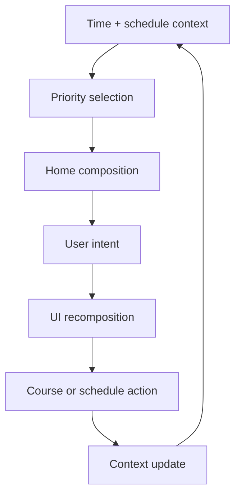

# Classing Mobile Interaction Specification

## 1. Product model

Classing Mobile is organized around a live academic context rather than app destinations.

The stable objects are course occurrences, schedule changes, tasks, exams, reminders, and AI queries. Screens are representations of those objects at different depths.

## 2. Information architecture

### Root and contextual destinations

| Destination | Entry | Exit / return behavior |
|---|---|---|
| Home | App launch, system back to root | Root; predictive back exits app |
| Timetable | Tap date/timeline, `View week`, or schedule search result | Returns to the exact Home composition and scroll/focus state |
| Course Detail | Tap any course card/timeline occurrence | Shared return to source card when it still exists |
| AI Schedule Assistant | Tap `Ask Classing`, keyboard shortcut, or assistant action | Clear/accept result returns to recomposed Home |
| Schedule Changes | Tap Home change card or changes indicator | Acknowledgement updates Home context |
| Settings | Tap profile/context avatar | Returns to previous destination; settings subpages use predictive back |

### No persistent bottom navigation on Home

Home does not show a traditional three-to-five item navigation bar. Access is contextual:

- Date or course timeline opens Timetable.
- Course island opens Course Detail.
- Change card opens Schedule Changes.
- Profile avatar opens Settings.
- Bottom `AiPromptBar` opens AI.

Timetable and Settings may expose a compact contextual back/action dock, but it must not resemble a persistent app-wide tab bar.

## 3. Home priority engine

The UI consumes an already-resolved schedule model. It must not decide schedule truth from visuals alone.

### Priority order

1. Safety/time-critical schedule change affecting the next 60 minutes.
2. Active course.
3. Course beginning within 30 minutes.
4. Break before the next course.
5. Finished-day tomorrow anchor.
6. No-class next academic anchor.
7. Homework due soon, exam, reminder, non-urgent change.

### Home state resolution

| Condition | State |
|---|---|
| `now ∈ [course.start, course.end)` | In class |
| next course is today and `0 < start-now ≤ 30 min` | Upcoming |
| previous course ended and next starts today within configured break horizon | Break |
| no remaining course today and at least one course occurred today | Finished |
| no effective course occurrence today | No class |
| otherwise, next class later today | Upcoming, relaxed variant |

Overlaps, cancelled occurrences, temporary moves, timezone changes, and semester-week rules are resolved before this state machine.

## 4. AI-first interaction model

### Is in-place UI recomposition reasonable?

Yes, for bounded schedule questions where the answer can be represented by existing Classing objects. It reduces navigation and preserves the temporal context that made the question meaningful.

It is not appropriate when:

- the answer is long-form explanation;
- the user needs to compare more than seven days or many courses;
- the query requests destructive schedule edits;
- confidence is low or the time/date reference is ambiguous.

Those cases open the expanded Assistant surface or request clarification.

### Context passed to Ask Classing

- Local date, time, timezone, locale, and first day of week.
- Effective timetable for the relevant range.
- Current/next course occurrence.
- Active schedule exceptions and changes.
- User-visible homework, exams, and reminders when permitted.
- Current Home state and the card that launched the query.

The UI must display the interpreted date range, such as `Today · Tue, Apr 23` or `This week · Apr 22–28`.

### Answer composition types

| Intent | Generated composition |
|---|---|
| `What's next?` | Single next-course focus card + travel/room metadata |
| `What's my afternoon like?` | Summary parent + cropped afternoon timeline |
| `When is biology?` | Course parent + occurrence child cards |
| `Do I have time for lunch?` | Free-window card bounded by adjacent course cards |
| `What homework is due today?` | Workload summary + homework child cards |
| `Which day is lightest?` | Week comparison parent + ranked day cards |
| `Tomorrow's first class?` | Tomorrow context anchor + one course card |

### Current-context protection

- During an active class, current course name, end time, and remaining duration cannot disappear behind an AI result.
- Within 15 minutes of a class, next course time and room remain in a compact top anchor.
- An imminent schedule change remains visible above AI content until acknowledged.

### Clarification

Ambiguous requests produce small choice cards, not a paragraph:

- `Biology` may refer to multiple courses → show course chips.
- `Tomorrow` across timezone change → show interpreted date.
- `Free` without duration → offer `30 min`, `45 min`, `1 hour` chips.

## 5. Timeline interaction

- Home timeline shows a temporal window: at most one previous item, current/next, and two future items.
- Past items collapse and lose contrast.
- Current time is a labeled node, not merely a colored dot.
- Tap a course item → Course Detail.
- Tap timeline whitespace or `View full day` → Timetable at the selected date.
- Long press is not a primary interaction; editing appears in Course Detail or Timetable actions.
- Timeline auto-updates at meaningful boundaries, not every second.

## 6. Schedule changes

- Home shows only the most urgent unresolved change plus an aggregate count.
- Change types: moved time, changed room, changed teacher, cancelled, added/make-up class.
- Each change exposes before/after values and effective occurrence/date.
- `Acknowledge` removes urgency but does not delete the record.
- `Open course` uses the changed occurrence, not the base recurring lesson.
- Conflicting changes show an explicit conflict state and do not silently pick one.

## 7. Course detail interaction

- Tapping a course occurrence opens the detail for that occurrence, preserving its date and exception state.
- Recurring course identity and occurrence identity are separate.
- Editing requires selecting scope: this occurrence, from this week, or whole course.
- Homework, exam, reminder, and schedule-change cards are children of the course context.
- Room tap may expose copy/navigation actions; external navigation is explicit.

## 8. Timetable interaction

- Default mobile mode is selected-day timeline with a compact week overview.
- Horizontal swipe changes the selected day; it does not accidentally switch app destinations.
- Week changes through explicit week control or horizontal gesture on the week header.
- Full dense grid is an optional overview mode and landscape enhancement, not Home.
- Today action returns to the current date and preserves the chosen view mode.

## 9. Settings interaction

- Settings opens from profile/avatar, not global bottom navigation.
- Settings home is grouped into large contextual islands: Schedule, Reminders, Appearance, Sync & Devices, Ask Classing, Account, About.
- High-risk operations such as clear timetable, restore snapshot, sign out, or account deletion are separated and require confirmation.
- Changes with immediate visual effect preview on the current surface and can be reverted.

## 10. Loading, offline, and stale data

| Condition | Behavior |
|---|---|
| Cold load with local schedule | Render local context immediately; sync indicator remains secondary |
| No local data | Show setup/import empty state, not No-class state |
| Offline | Continue local schedule and reminders; AI prompt shows offline limitation |
| Stale cloud data | Show `Last synced…` only when relevant; never block timetable |
| AI unavailable | Preserve Home; prompt changes to retry/offline action |
| Partial schedule import | Show import warning in Schedule Changes/Settings, not as Home hero unless today is affected |

## 11. Focus, back, and state restoration

- Android predictive back is supported for detail and assistant expansions.
- Returning from detail restores source date, position, and card focus.
- Process recreation restores destination and selected date but recomputes time-derived Home state.
- App resume never replays old transitions; it renders the correct state and announces meaningful changes once.
- Deep links to a course or date enter the relevant detail with a visible route back to Home.

## 12. Analytics boundaries

Permitted product events should describe interaction, not sensitive content:

- Home state shown.
- Prompt opened/submitted.
- Result composition type.
- Course detail opened.
- Schedule change acknowledged.

Do not log raw AI queries, course notes, teacher names, room data, or homework content without explicit privacy design and consent.

